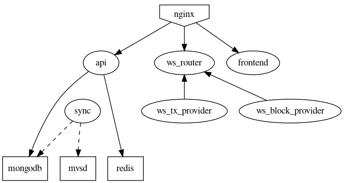

<p align="center">
  <a href="https://www.mvs.org/">
    
  </a>
  <h1 align="center">Metaverse Blockchain Explorer</h1>
</p>

# Setup
The easiest way to startup the services is using docker compose. It will automaticlly download and start all dependencies except for the frontend.

```
cd setup
docker-compose up --build
```

It will setup all backend and frontend services. Then it syncs the blockchain to a mongodb.



# Configuration

## API configuration

| Environment variable | Description           |   Default |
| ---                  | ---                   |       --- |
| MONGO_HOST           | MongoDB host          | 127.0.0.1 |
| MONGO_PORT           | MongoDB port          |     27017 |
| MONGO_NAME           | MongoDB database name | metaverse |
| REDIS_HOST           | Redis host            | 127.0.0.1 |
| REDIS_PORT           | Redis port            |      6379 |

## Websocket provider configuration

| Environment variable | Description                         | Default                |
| ---                  | ---                                 | ---                    |
| MONGO_HOST           | MongoDB host                        | 127.0.0.1              |
| MONGO_PORT           | MongoDB port                        | 27017                  |
| MONGO_NAME           | MongoDB database name               | metaverse              |
| REALM                | Websocket realm                     | realm1                 |
| WS_USER              | Username for websocket              | blockprovider          |
| WS_SECRET            | Password for websocket              | secret!!!              |
| BLOCK_TIMER          | Update time for blocks              | 1000                   |
| TRANSACTION_TIMER    | Update time for transactions        | 1000                   |
| PROVIDE_TASK         | Provider type (BLOCKS/TRANSACTIONS) | TRANSACTIONS           |
| ROUTER_URL           | URL of router                       | ws://127.0.0.1:8080/ws |

## Sync configuration

| Environment variable | Description           |   Default |
| ---                  | ---                   |       --- |
| MONGO_HOST           | MongoDB host          | 127.0.0.1 |
| MONGO_PORT           | MongoDB port          |     27017 |
| MONGO_NAME           | MongoDB database name | metaverse |
| MVSD_HOST            | MVSD host             | 127.0.0.1 |
| MVSD_PORT            | MVSD port             |      8820 |

# Help

Please feel free to create issues for questions or feature request. If you want to setup a production environment you should not just use the example docker configuration. At least try to setup a dedicated mongodb (cluster).

# Contribution

We <3 our contributors! Many thanks to all supporters. We want to encourage everyone to become part of the development and support us with translations, testing and patches. If you want to help us please don't hesitate to contact us and become a part of the community.

